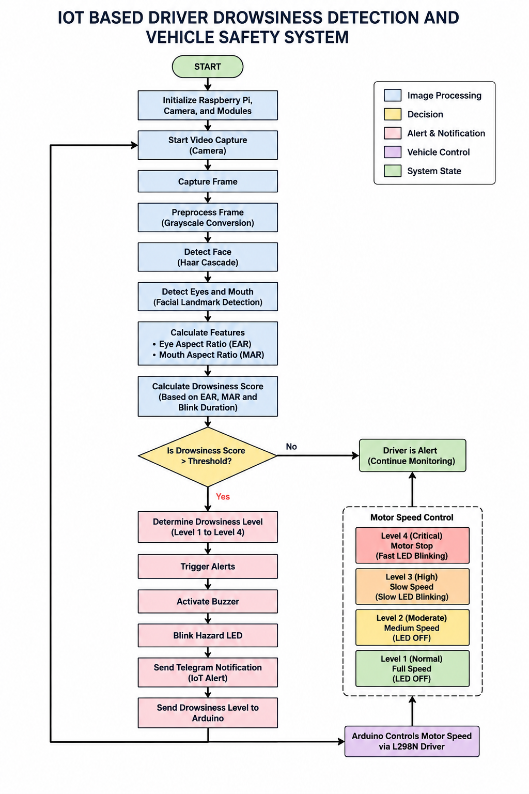
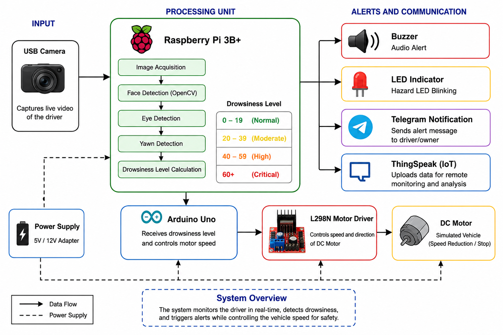
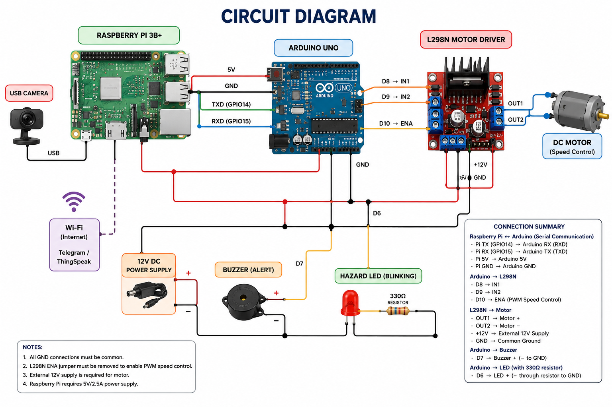
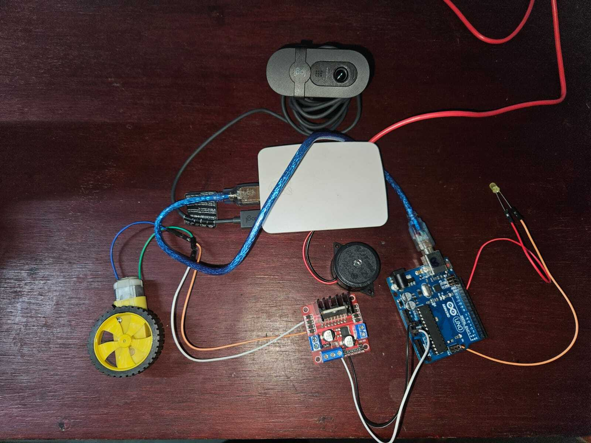
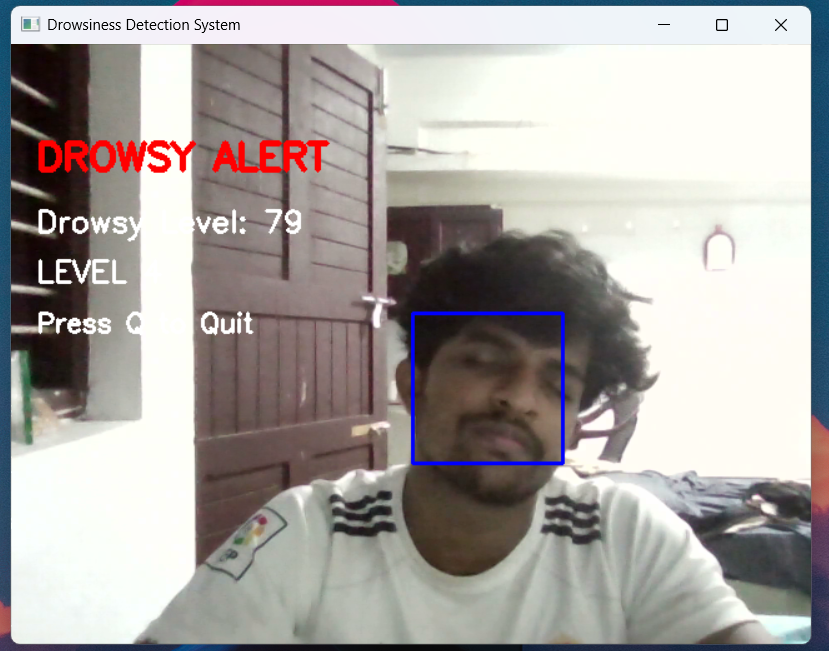
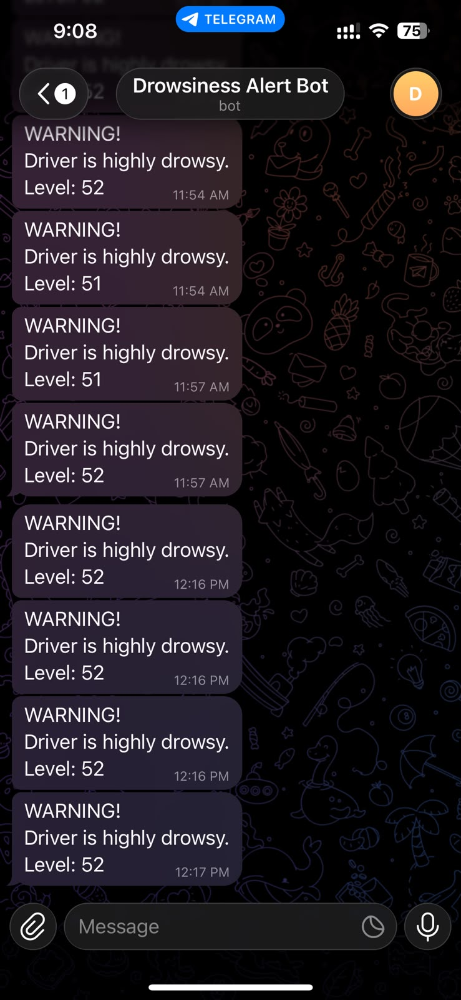

# 🚗 IoT-Based Driver Drowsiness Detection and Vehicle Safety System

## 📌 Overview

This project is a real-time IoT-based driver drowsiness detection and vehicle safety system developed using:

- Raspberry Pi 3B+
- OpenCV
- Arduino Uno
- L298N Motor Driver
- DC Motor
- Telegram IoT Alerts
- LED and Buzzer Warning System

The system continuously monitors the driver using a USB camera and detects:

- Eye closure duration
- Yawning behavior
- Driver fatigue level

When drowsiness is detected, the system automatically:

✅ Activates buzzer alerts  
✅ Blinks hazard LED  
✅ Sends Telegram notification  
✅ Reduces motor speed  
✅ Stops motor during critical drowsiness  

---

# 🎯 Objectives

- Detect driver drowsiness in real time
- Improve road safety using IoT technology
- Provide instant alert mechanisms
- Demonstrate intelligent vehicle safety control
- Reduce fatigue-related road accidents

---

# 🌍 Sustainable Development Goal (SDG)

This project aligns with:

## SDG 3 — Good Health and Well-Being

The system helps reduce road accidents caused by driver fatigue and improves transportation safety.

---

# 🛠 Hardware Components

| Component | Purpose |
|---|---|
| Raspberry Pi 3B+ | Main processing unit |
| USB Camera | Captures live driver video |
| Arduino Uno | Motor and LED control |
| L298N Driver | Motor speed control |
| DC Motor | Vehicle simulation |
| Buzzer | Audio warning alert |
| LED | Hazard warning indicator |

---

# 💻 Software Used

- Python
- OpenCV
- Arduino IDE
- Telegram Bot API

---

# ⚙️ Features

- Real-time face detection
- Eye closure monitoring
- Yawning detection
- Dynamic drowsiness level calculation
- Telegram IoT alert system
- Motor speed reduction
- Hazard LED blinking
- Audio buzzer alerts

---

# 🧠 Working Principle

1. USB camera captures live video
2. OpenCV processes image frames
3. Haar Cascade detects face and eyes
4. System monitors eye closure and yawning
5. Drowsiness score is calculated
6. Alerts are triggered when threshold exceeds
7. Telegram notification is sent
8. Arduino controls motor speed and LED

---

# 🔌 Hardware Connections

## Raspberry Pi Connections

| Component | GPIO Pin |
|---|---|
| Buzzer (+) | GPIO 18 |
| Buzzer (-) | GND |

---

## Arduino Connections

| Arduino Pin | Connected To |
|---|---|
| D8 | IN1 (L298N) |
| D9 | IN2 (L298N) |
| D10 | ENA (L298N) |
| D7 | LED (+) |
| GND | LED (-) |

---

## Motor Driver Connections

| L298N Pin | Connection |
|---|---|
| OUT1 | Motor Terminal 1 |
| OUT2 | Motor Terminal 2 |
| IN1 | Arduino D8 |
| IN2 | Arduino D9 |
| ENA | Arduino D10 |
| GND | Arduino GND |

---

# 📷 Project Images

## System Flow Diagram



---

## Block Diagram



---

## Circuit Diagram



---

## Hardware Prototype



---

## Live Drowsiness Detection Output



---

## Telegram Alert Notification



---

# 📊 Results

The developed system successfully performs:

- Real-time drowsiness detection
- Telegram-based remote alerts
- Motor speed control
- Hazard indication
- Audio warning generation

---

# 📈 Performance Metrics

| Parameter | Result |
|---|---|
| Face Detection Accuracy | 90% |
| Eye Detection Accuracy | 85% |
| Alert Response Time | < 2 seconds |
| Telegram Delay | 2–4 seconds |
| Processing Speed | Real-time |

---

# ⚠️ Limitations

- Reduced accuracy under poor lighting
- Difficulty detecting eyes with spectacles
- Face angle sensitivity
- Camera quality dependency

---

# 🚀 Future Improvements

- Deep learning-based facial landmark detection
- Infrared night vision support
- Mobile application integration
- GPS emergency alerts
- Cloud analytics dashboard
- Real vehicle deployment

---

# ▶️ Installation

## Install Python Libraries

```bash
pip install -r requirements.txt
```

---

# ▶️ Run Raspberry Pi Code

```bash
python3 raspberry_pi_code.py
```

---

# ▶️ Upload Arduino Code

1. Open Arduino IDE
2. Select:
   - Board → Arduino Uno
   - Port → COM Port
3. Upload `arduino_code.ino`

---

# 📂 Repository Structure

```bash
.
├── raspberry_pi_code.py
├── arduino_code.ino
├── requirements.txt
├── IOT_Project_Report.pdf
├── hardware.png
├── output.png
├── telegram.png
├── flowdiagram.png
├── BlockDiagram.png
├── CircuitDiagram.png
└── README.md
```

---

# 👨‍💻 Authors

- Sidharth M
- V Balagopal
- Shivanandan J
- Sai Akshay Varma

Dept. of Computer Science and Engineering (AI)  
Amrita Vishwa Vidyapeetham

---

# 📜 License

This project is licensed under the MIT License.
